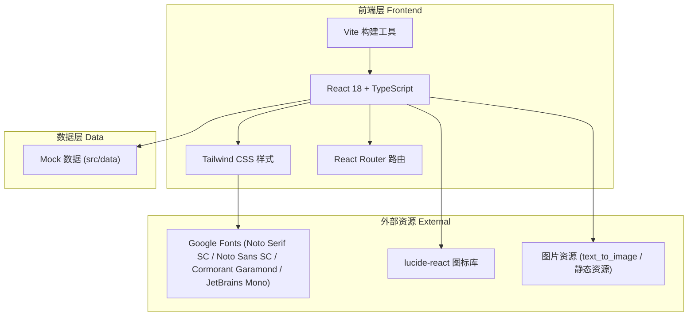
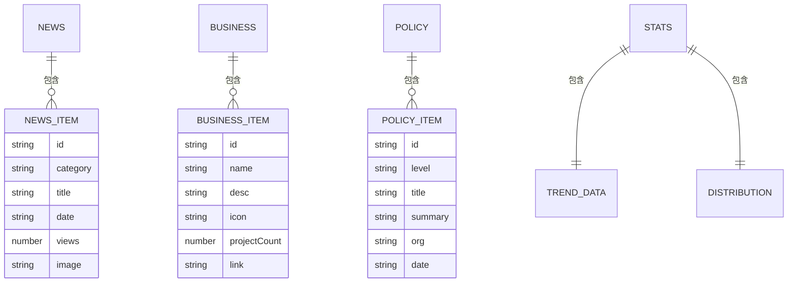

# 成都农村产权交易所官网 - 技术架构文档

## 1. 架构设计

本项目为纯前端展示型单页应用，无后端服务。所有数据以 Mock 形式内置，便于快速预览与后续接入真实接口。



## 2. 技术说明

- **前端**：React@18 + TypeScript + tailwindcss@3 + vite
- **初始化工具**：vite-init（使用 `react-ts` 模板，含 react-router-dom、tailwind、zustand）
- **后端**：无（纯前端展示站点）
- **数据库**：无（Mock 数据内置）
- **图标**：`lucide-react`
- **图表**：纯 CSS/SVG 手绘（折线图、环形图），不引入重型图表库，保证视觉风格统一与轻量
- **字体**：Google Fonts 在线引入

## 3. 路由定义

| 路由 | 用途 |
|-------|---------|
| `/` | 首页（单页长滚动，包含全部板块） |

> 单页站点，所有板块通过锚点滚动定位（#hero / #about / #business / #data / #news / #policy / #partners / #contact）。

## 4. API 定义

无后端 API。所有展示数据以内置 Mock 形式存储于 `src/data/`：

- `news.ts`：新闻列表（本所新闻 / 业界动态 / 通知公告）
- `business.ts`：核心业务平台信息
- `policy.ts`：政策法规列表
- `stats.ts`：数据中心统计指标与图表数据
- `partners.ts`：合作伙伴列表

## 5. 服务端架构

不适用（无后端）。

## 6. 数据模型

### 6.1 数据模型定义



### 6.2 数据定义语言

不适用（无数据库，使用 TypeScript 类型与常量数据）。

## 7. 目录结构

```
src/
├── components/          # 通用组件
│   ├── Navbar.tsx
│   ├── Hero.tsx
│   ├── Ticker.tsx       # 行情滚动条
│   ├── About.tsx
│   ├── Business.tsx
│   ├── DataCenter.tsx
│   ├── NewsCenter.tsx
│   ├── Policy.tsx
│   ├── Partners.tsx
│   ├── Contact.tsx
│   └── Footer.tsx
├── data/                # Mock 数据
│   ├── news.ts
│   ├── business.ts
│   ├── policy.ts
│   ├── stats.ts
│   └── partners.ts
├── hooks/               # 自定义 hooks
│   └── useCountUp.ts    # 数字滚动动画
├── pages/
│   └── Home.tsx         # 首页（组合所有板块）
├── App.tsx
├── main.tsx
└── index.css            # Tailwind + 全局样式 + 字体引入
```
